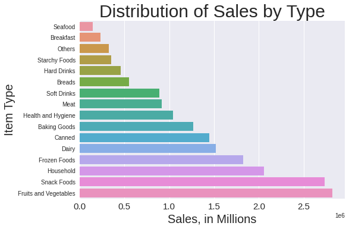
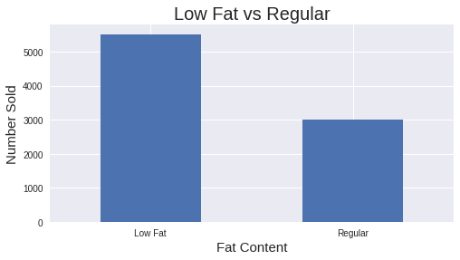
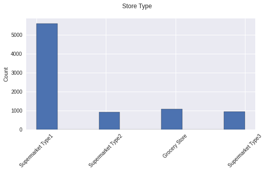

 # Big Mart Sales Predictions
## Analysis of Sales Based on Item Type, Fat Content, and Store Type

**Author**: Laura Dimaria

### Business problem:

Using Item Type, Fat Content, and Store Type to increase sales for Big Mart

### Data:
For this project, we used a dataset for a supermarket chain to predict sales in the future.

## Methods
- Data was first prepared using Pandas to clean the data and drop any unnecessary information for our predictions.
- We then used MatPlotLib to visualize and explore our data.
- Lastly, we used SciKitLearn to scale, encode, and model our data using various methods, some better than others.

## Results

### Here are examples of how to embed images from your sub-folder

#### Sales Distribution

> Distribution of Sales based on Item Type, in Millions.
####Fat Content

>Number of items sold based on Fat Content.
####Types of Stores

>Big Mart Types of stores.

## Model
For our model, we used many different metrics, the most sucessful being RMSE for Linear Regression. The model was able to predict sales within $50 of the correct price. The other models tested faired much worse and should not be used.

## Recommendations:

For this specific case of sales predictions for Big Mart, I would recommend using neither of the models provided. The Linear Regression Model is only preforming at 56% for both the training and testing data and needs more tuning, work, and analysis to increase its functionality.

The Decision Tree Model is preforming poorly as well, with results that are extremely skewed on the Testing Data. This may be due to an error on my part, or with the data itself. This model needs to be reworked and fine tuned to preform well. The R2 score on the testing date itself is 83 points off from the training data, which is highly unacceptable if it would need to be deployed in the real world.

## Limitations & Next Steps

I would suggest limiting any predictions on this model and using it to rework the data. The models are not functional for a real world scenario.

### For further information

For any additional questions, please contact **laura.e.dimaria@gmail.com**
